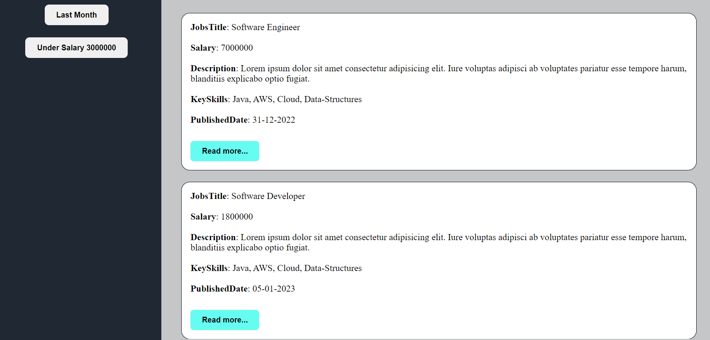

# **Finding job**

A JavaScript project that utilizes the filter method and an open modal feature could be an interactive website that allows users to search through a list of jobs and display the results in a modal window. The filter method would be used to search through the list of items and only display those that match the user's search criteria. The modal window would be used to display the search results in a clear and easy-to-read format.

### ADD IMAGE

## Trainer Target

- Filter method
- Javascript
- Functionalities of code

## Trainee Achieved

- having knowledge of filter method
- Learned functionalities also

## Tech stack

### _Language_ : HTML, CSS, Javascript
